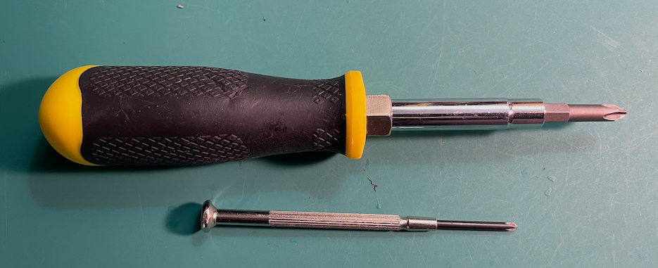

## Download and install the Arduino IDE
- The latest release can be found at https://www.arduino.cc/en/software/
- Select the operating system you are using.  (It may already be selected)
- Click download
## Configure the Arduino IDE for the ESP8266
- This page https://randomnerdtutorials.com/how-to-install-esp8266-board-arduino-ide/ from Random Nerds Tutorial provides great instructions and a video demonstration of this.

## Download and install the RemoteXY app:
- The app is available on Google Play and Apple App Store.  Search for RemoteXY and install.
- If you have trouble finding it, go to https://remotexy.com/en/download/

## Tools:
- Phillips Screwdriver
	- I used these two...
	

## References:
[Arduino](https://www.arduino.cc/)
[Arduino Downloads](https://www.arduino.cc/en/software/)
[Random Nerd Tutorials - Installing ESP8266 Board in Arduino IDE](https://randomnerdtutorials.com/how-to-install-esp8266-board-arduino-ide/)
[RemoteXY](https://remotexy.com/en/)
